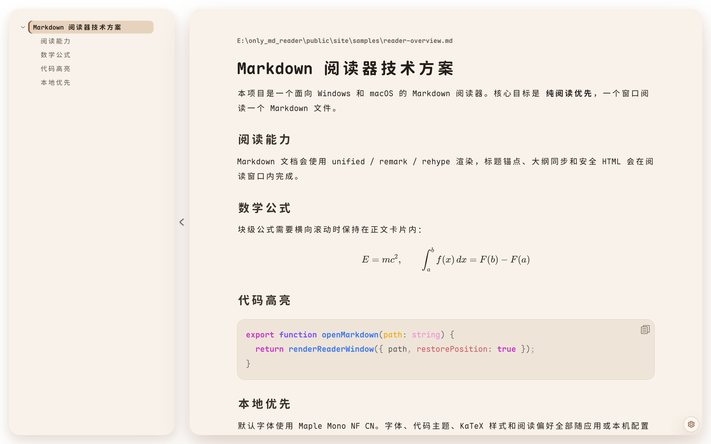
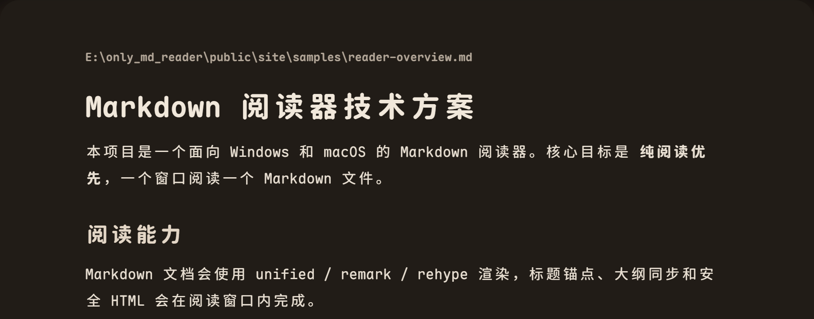
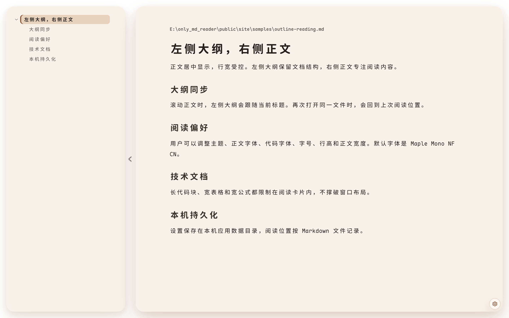
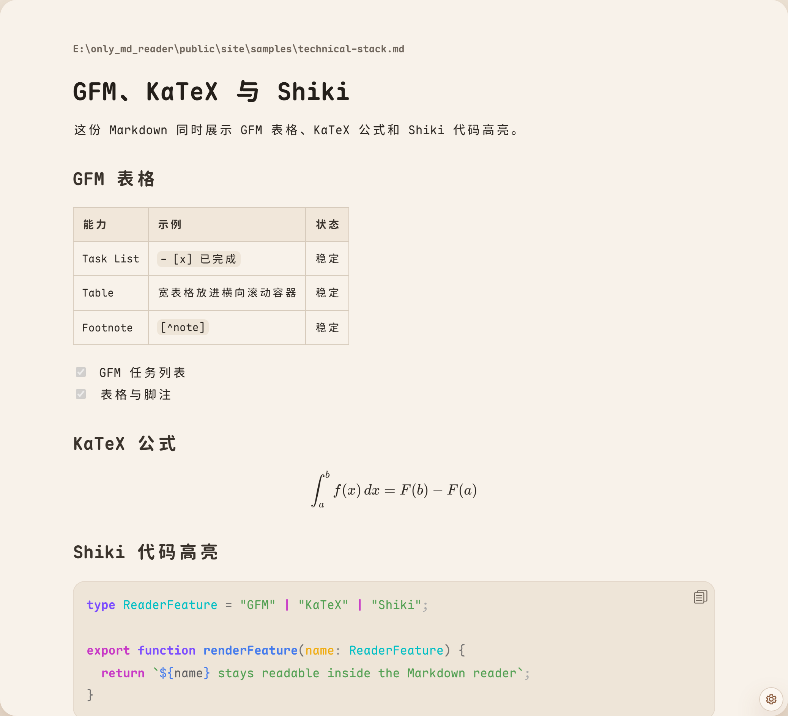

# MD极简阅读

一个面向 Windows 和 macOS 的 Markdown 阅读器。目标很窄：打开本地 Markdown 文件，进入一个干净、稳定、适合长时间阅读的独立窗口。

它不是 Markdown 编辑器，不做文件管理器，不做标签页，也不在第一版里处理批注写回。第一版优先把阅读体验、离线资源、系统集成和打包发布做扎实。

## 截图









## 功能

- 一个 Markdown 文件对应一个独立阅读窗口。
- 重复打开同一个文件时聚焦已有窗口，不创建重复窗口。
- 左侧大纲，右侧正文，正文居中阅读。
- 支持明亮主题、暗色主题和跟随系统。
- 支持 CommonMark、GFM 表格、任务列表、删除线和自动链接。
- 支持 KaTeX 数学公式。
- 支持 Shiki 代码高亮，默认使用 Eva Light Bold / Eva Dark Bold。
- 支持代码块一键复制、正文选区复制和大纲跳转。
- 支持相对路径图片、图片失败状态和宽表格横向滚动。
- 支持阅读偏好持久化：主题、字体、字号、行高和正文宽度。
- 默认随包分发 Maple Mono NF CN，不依赖目标机器已安装字体。
- 运行时资源全部本地打包，不依赖 CDN 或远程字体、主题、脚本、样式。
- 支持注册 `.md` / `.markdown` 文件关联。

## 技术栈

- 桌面框架：Tauri 2
- 前端框架：React
- 语言：TypeScript + Rust
- 构建：Vite
- Markdown 管线：unified / remark / rehype
- 数学公式：KaTeX
- 代码高亮：Shiki
- 批注格式：CriticMarkup，放在后续阶段实现

## 本地开发

需要 Node.js、pnpm、Rust 和 Tauri 2 所需平台依赖。

```powershell
pnpm install
pnpm tauri:dev
```

前端开发服务器：

```powershell
pnpm dev
```

## 验证

常规验证：

```powershell
pnpm test
pnpm lint
pnpm format:check
pnpm build
cargo test --manifest-path src-tauri\Cargo.toml
```

可视和性能验证：

```powershell
pnpm qa:settings-ui
pnpm qa:reader-ui
pnpm qa:markdown-performance
pnpm qa:screenshots
```

## 打包

生成本机测试用可执行文件，不产出安装包：

```powershell
pnpm tauri build --no-bundle --ci
```

生成 Windows MSI 安装包：

```powershell
pnpm tauri build --bundles msi
```

发布包应由 GitHub Actions 生成并上传到 GitHub Release。构建产物不要提交到 Git。

## 目录

- `src/`：React 前端、Markdown 渲染、主题、设置和阅读窗口逻辑。
- `src-tauri/`：Tauri / Rust 原生窗口、文件读取、设置持久化、文件关联和系统集成。
- `docs/`：技术架构、路线图、实现工作列表、QA 文档和 UI 原型。
- `docs/assets/readme/`：README 使用的项目截图。
- `fixtures/`：Markdown 渲染和 QA 样例。
- `tools/`：仓库内固定 QA 脚本。

## 当前边界

第一版不包含完整 Markdown 编辑器、文件树、标签页、云同步、PDF 导出、账号系统、插件系统和实时协作。CriticMarkup 批注会在阅读器稳定后再实现。
