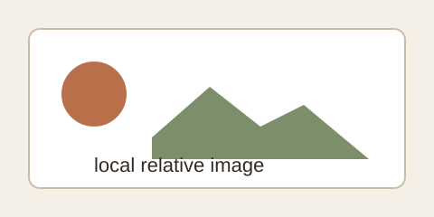

# Worklist 7/8/9 Visual Verification

Intro paragraph with **strong text**, *emphasis*, [official link](https://example.com/docs), <mark>marked text</mark>, and inline `token-color`.

> Blockquote using Warm Paper quote tokens.

## 7 Markdown Core

- [x] task item rendered by GFM
- [ ] pending item rendered by GFM
- ~~removed text~~
- https://example.com/docs/markdown-reader

| Column | Wide heading for horizontal table behavior | Notes |
| --- | --- | --- |
| alpha | this table deliberately has a long cell to require horizontal scrolling in the reading card on narrower widths | row one |
| beta | another long cell that must stay inside the table scroller and not expand the whole layout | row two |




<script>window.__md_reader_script_executed = true</script>

<a href="javascript:alert('x')">dangerous link</a>

## 8 Outline System

### 8.1 AST Heading

Text under heading one.

### 8.2 Duplicate Heading

Text under duplicate heading.

### 8.2 Duplicate Heading

Duplicate heading slug should be stable.

## 9 Rich Content

Inline formula $E = mc^2$ and block formula:

$$
\int_0^1 x^2 dx = \frac{1}{3}
$$

Bad formula $\notacommand{$ should not blank the document.

```ts
export function renderWideLine(input: string) {
  const longValue = "abcdefghijklmnopqrstuvwxyz".repeat(8);
  return input + "-" + longValue;
}
```

$$
\begin{aligned}
aaaaaaaaaaaaaaaaaaaaaaaaaaaaaaaaaaaaaaaaaaaaaaaaaaaaaaaaaaaaaaaaaaaaa &= bbbbbbbbbbbbbbbbbbbbbbbbbbbbbbbbbbbbbbbbbbbbbbbbbbbbbbbbbbbbbbb \\
cccccccccccccccccccccccccccccccccccccccccccccccccccccccccccccccc &= ddddddddddddddddddddddddddddddddddddddddddddddddddddddddddddddd
\end{aligned}
$$

## Appendix

Final paragraph for scroll sync.
